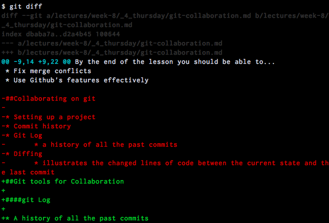
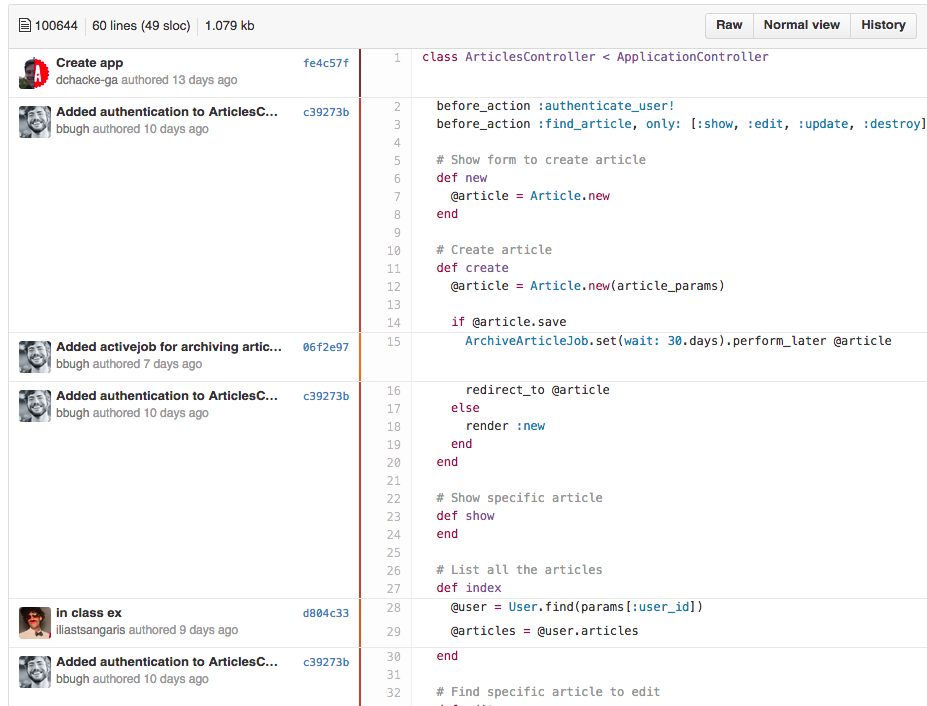
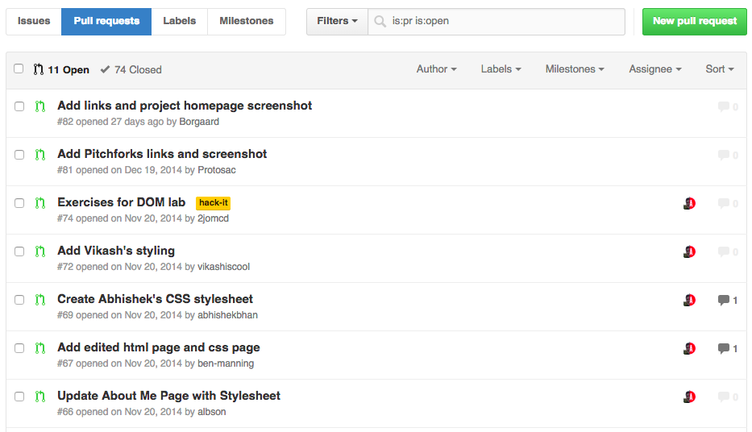
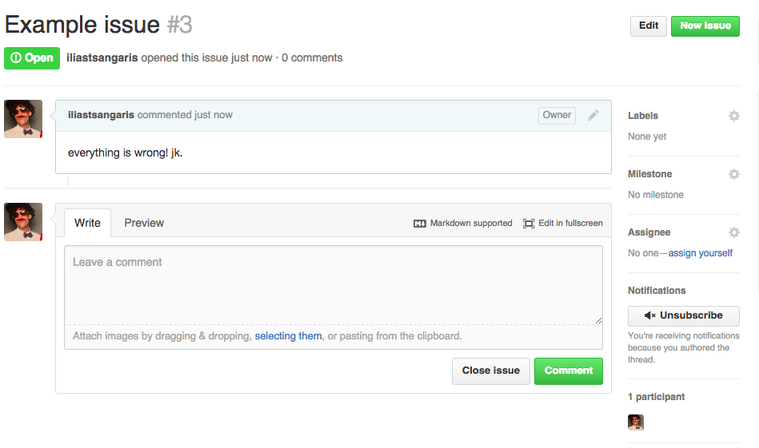
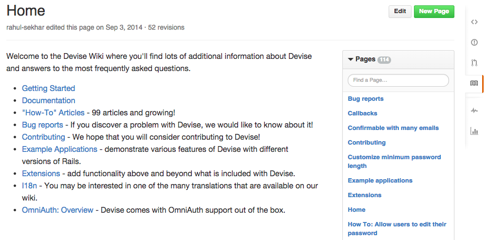

#Git Collaboration

##Learning Objectives
By the end of the lesson you should be able to...


* Collaborate on a git project
* Use feature branches appropriately
* Fix merge conflicts
* Use Github's features effectively

##Git tools for Collaboration

####git log

* A history of all the past commits
* Useful for view old code changes and your teammate's contributions


####git diff

* Illustrates the changed lines of code between the current state and the last commit



##Feature Branching

Think about a designer at Tesla

* There exists a 2014 master Tesla
* We want to build a 2015 concept Tesla
* In order to preserve the master, the designer decides that it's better to copy the master than directly modify it
* Once copied we can feel free to iterate without any destructive consequences as we will now always be able to revert back to the existing 2014 master
* Once Elon is satisfied we can merge the concept features into a new 2015 master Tesla

in other words...

* A branch represents an independent line of development
* New features should be developed in a branch of the repository
* Once the feature is complete & working it can be merged into the main repository
* Commands
	* `git branch` — creates a new branch
	* `git checkout` — jumps into a specific branch
	* `git merge` — combines two branches

##Merge Conflicts

* Occurs when there are disagreeing changes between two commits

Example conflict:

```
the number of planets are
<<<<<<< HEAD
nine
=======
eight
>>>>>>> branch-a
```

##Using Github Effectively

####Blaming

* Points out who change which lines in a file and why
[Example](https://github.com/sf-wdi-14/rails-review/blame/master/app/controllers/articles_controller.rb)



####Diffing (again)

* Displays the changed lines of code
[Example](https://github.com/sf-wdi-14/rails-review/commit/06f2e972016d421f4aff9c170cbf335a4bcde552)


####History

* Shows a history of the git commits
[Example](https://github.com/sf-wdi-14/rails-review/commits/master)


####Branches

* Enables one to view all the branches in a repository
* Ideal for collaborating between individuals in a single team
[Example](https://github.com/sf-wdi-14/rails-review/branches)


####Forking

* Creates a remote clone that you now own which you can make changes to
* This is particularly useful for open source projects
* Forking is great for collaborating between separate teams 

####Pull Requests

* Used to request that a fork is merged or "pulled" into an upstream repository
* This allows the upstream repository owner the discretion of which forks can be merged
* Enables one to submit code to any public repository
[Example](https://github.com/sf-wdi-14/notes/pulls)


####Issues

* Anyone can submit an issue for a public repo that the owner will be made aware of
* Issues are open by anyone if they have identified a problem in the code
* Issues are closed once the problem is solved
[Example](https://github.com/sf-wdi-14/rails-review/issues)


####Comments

* At the bottom of a specific commit, issue, or pull request you may leave a comment and @mention a user

####Wiki

* Typically used for more advanced documentation for your library; aka an expanded readme
* Also keep in mind, you can use it for whatever suits your needs best
[Divise's Wiki](https://github.com/plataformatec/devise/wiki)



##Additional Resources
* [Become a git guru](https://www.atlassian.com/git/tutorials/)
* [How Git Works Video Overview](https://www.youtube.com/watch?v=1ffBJ4sVUb4)
* [Git deep-dive](http://think-like-a-git.net/)